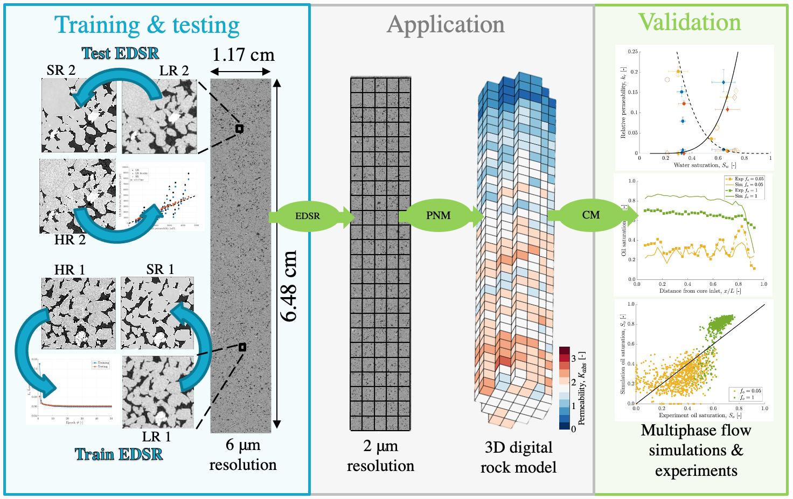

EDSR modelling
=====
A Github repository for deep-learning image enhancement, pore-network and continuum modelling from X-Ray Micro-CT images. The repository contains all code necessary to recreate the results in the paper [Deep learning of multi-resolution X-Ray micro-CT images for multi-scale modelling](https://arxiv.org/abs/2111.01270) by Jackson, S.J., et al. 2021 [1]. The images that are used in various parts of the code are found on [Zenodo at DOI: 10.5281/zenodo.5542624](https://doi.org/10.5281/zenodo.5542623). There is previous experimental and modelling work performed in the papers of [2,3]. 

*Summary of the workflow, flowing from left to right. First, the EDSR network is trained \& tested on paired LR and HR data to produce SR data which emulates the HR data. Second, the trained EDSR is applied to the whole core LR data to generate a whole core SR image. A pore-network model (PNM) is then used to generate 3D continuum properties at REV scale from the post-processed image. Finally, the 3D digital model is validated through continuum modelling (CM) of the muiltiphase flow experiments.*

The workflow image above summarises the general approach. We list the detailed steps in the workflow below, linking to specific files and folders where necesary. 

# 1. Generating LR, Cubic and HR data
The low resolution (LR) and high resolution (HR) can be downloaded from [Zenodo at DOI: 10.5281/zenodo.5542624](https://doi.org/10.5281/zenodo.5542623). The following code can then be run:

* [A0_0_0_Generate_LR_bicubic.m](./A0_0_0_Generate_LR_bicubic.m) This code generates Cubic interpolation images from LR images, artifically decreasing the pixel size and interpolating, for use in comparison to HR and SR images later.
* [A0_0_1_Generate_filtered_images_LR_HR.m](./A0_0_1_Generate_filtered_images_LR_HR.m). This code performs non-local means filtering of the LR, cubic and HR images, given the settings in the paper [1]. 

# 2. EDSR network training 
The 3d EDSR (Enhanced Deep Super Resolution) convolution neural network used in this work is based on the implementation of the CVPR2017 workshop Paper: "Enhanced Deep Residual Networks for Single Image Super-Resolution" (https://arxiv.org/pdf/1707.02921.pdf) using PyTorch. 

The folder [3D_EDSR](./3D_EDSR) contains the EDSR network training & testing code. The code is written in Python, and tested in the following environment:
* Windows 10
* Python 3.7.4
* Pytorch 1.8.1
* cuda 11.2
* cudnn 8.1.0

The Jupyter notebook [Train_review.ipynb](./3D_EDSR/Train_review.ipynb), contains cells with the individual .py codes copied in to make one continuous workflow that can be run for EDSR training and validation. In this file, and those listed below, the LR and HR data used for training should be stored in the top level of [3D_EDSR](./3D_EDSR), respectively, as:

* Core1_Subvol1_LR.tif
* Core1_Subvol1_HR.tif

To generate suitable training images (sub-slices of the full data above), the following code can be run:

* [train_image_generator.py](./3D_EDSR/train_image_generator.py). This generates LR and registered x3 HR sub-images for EDSR training, sub-image sizes are of  flexible size, dependent on the pore-structure. The LR/HR sub-images are separated into two different folders [LR](./3D_EDSR/Mini_data/TEST/LR) and [HR](./3D_EDSR/Mini_data/TEST/HR)

The EDSR model can then be trained on the LR and HR sub-sampled data via:

* [main_edsr.py](./3D_EDSR/main_edsr.py). This trains the EDSR network on the LR/HR data. It requires the code [load_data.py](./3D_EDSR/load_data.py), which is the sub-image loader for EDSR training. It also requires the 3D EDSR model structure code [edsr_x3_3d.py](./3D_EDSR/edsr_x3_3d.py). The code then saves the trained network as [3D_EDSR.pt](./3D_EDSR/3D_EDSR.pt). The version supplied here is that trained and used in the paper.  

To view the training loss performance, the data can be output and saved to .txt files. The data can then be used in:

* [A0_0_5_Plot_EDSR_loss.m](./A0_0_5_Plot_EDSR_loss.m). This simply plots the trained EDSR model loss and PSNR. The data for the publication EDSR are stored in  [EDSR_training_results](./EDSR_training_results). 

# 3. EDSR network verification

The trained EDSR network at [3D_EDSR.pt](./3D_EDSR/3D_EDSR.pt) can be verified by generating SR images from a different LR image to that which was used in training. Here we use the second subvolume from core 1, found on [Zenodo at DOI: 10.5281/zenodo.5542624](https://doi.org/10.5281/zenodo.5542623):

* Core1_Subvol2_LR.tif

The trained EDSR model can then be run on the LR data using:

* [validation_image_generator.py](./3D_EDSR/validation_image_generator.py). This creates input validation LR images. The validation LR images have large size in x,y axes and small size in z axis to reduce computational cost.
* [main_edsr_validation.py](./3D_EDSR/main_edsr_validation.py).  The validation LR images are used with the trained EDSR model to generate 3D SR subimages. These can be saved in the folder [SR_subdata](./3D_EDSR/SR_subdata) as the  Jupyter notebook [Train_review.ipynb](./3D_EDSR/Train_review.ipynb) does. The SR subimages are then stacked to form a whole 3D SR image.

Following the generation of suitable verification images, various metrics can be calculated from the images to judge performance against the true HR data:

* [A0_0_2_Generate_histogram_data.m](./A0_0_2_Generate_histogram_data.m). This code generates histograms of the LR, Cubic, HR and SR image grey scale values for comparison. The results are saved to [Matlab_results](./Matlab_results).
* [A0_0_3_Generate_SSIM_2D_3D.m](./A0_0_3_Generate_SSIM_2D_3D.m). This code generates structural similarity index measures between the Cubic, HR and SR images. The results are saved to [Matlab_results](./Matlab_results).
* [A0_0_4_Generate_run_PNM_LR_Cubic_HR_SR_subvolumes.m](./A0_0_4_Generate_run_PNM_LR_Cubic_HR_SR_subvolumes.m). This generates a pore-network model (PNM) of the LR, Cubic and SR subvolume images. The code as default does this for all 4 subvolumes in Core 1 and Core 2, but can be set to only run for one validation subvolume as required. The code generates multiple networks across different segmentation realizations for the LR, Cubic, HR and SR images. The networks are used in the pore-network modelling approach from the ICL Github: (https://github.com/ImperialCollegeLondon/pnextract, https://github.com/ImperialCollegeLondon/pnflow). The results are saved to [Matlab_results](./Matlab_results) as [Results_PNM_whole_core_LR_EDSR.m](./Matlab_results/Results_PNM_LR_HR_SR_sensitivity_all.mat) 

Following the generation of these metrics, several plotting codes can be run to compare LR, Cubic, HR and SR results:

* [A0_1_0_Plot_raw_filtered_images_2D.m](./A0_1_0_Plot_raw_filtered_images_2D.m). This plots the raw and filtered LR, Cubic, HR and SR images for comparison. It plots a selected 2D slice. 
* [A0_1_1_Plot_histograms.m](./A0_1_1_Plot_histograms.m). This plots the histograms of the image greyscale values on top of each other for comparison purposes from [Matlab_results](./Matlab_results).
* [A0_1_2_Plot_filtered_image_similarities.m](./A0_1_2_Plot_filtered_image_similarities.m). The plots the fitlered SSIM from [Matlab_results](./Matlab_results).
* [A0_1_3_Plot_PNM_LR_HR_EDSR_sensitivity.m](./A0_1_3_Plot_PNM_LR_HR_EDSR_sensitivity.m). This plots the petrophysical predictions from the PNM across the different image subvolumes and segmentation realisations for the LR, Cubic, HR and SR images from [Results_PNM_LR_HR_SR_sensitivity_all.mat](./Matlab_results/Results_PNM_LR_HR_SR_sensitivity_all.mat) 

# 4. Continuum modelling and validation

After the EDSR images have been verified using the image metrics and pore-network model simulations, the EDSR network can be used to generate continuum scale models, for validation with experimental results. We compare the simulations using the continuum models to the accompanying experimental dataset in [2]. First, the following codes are run on each subvolume of the whole core images, as per the verification section:

* [validation_image_generator.py](./3D_EDSR/validation_image_generator.py).
* [main_edsr_validation.py](./3D_EDSR/main_edsr_validation.py). 

The subvolume (and whole-core) images can be found on the [Digital Rocks Portal](http://digitalrocksportal.org/projects/229) and on the [BGS National Geoscience Data Centre](http://dx.doi.org/10.5285/5f899de8-4085-4370-a45e-e613f27e8f1d), respectively. This will result in SR images (with the pre-exising LR) of each subvolume in both cores 1 and 2. After this, pore-network modelling can be performed using:

* [A1_0_0_Generate_run_PNM_whole_core.m](./A1_0_0_Generate_run_PNM_whole_core.m). This code generates pore-networks for each subvolume in the full core images. It generates this for both the LR and SR images. The networks are then used in the pore-network modelling approach from the ICL Github: (https://github.com/ImperialCollegeLondon/pnextract, https://github.com/ImperialCollegeLondon/pnflow). The results are saved to individual subvolume files for each core at [PNM_whole_core_LR_EDSR_results](./PNM_whole_core_LR_EDSR_results).

The whole core results can then be compiled into a single dataset .mat file using:

* [A1_0_1_Compile_whole_core_PNM.m](./A1_0_1_Compile_whole_core_PNM.m). The results are saved in [Matlab_results](./Matlab_results) as [Results_PNM_whole_core_LR_EDSR.mat](./Matlab_results/Results_PNM_whole_core_LR_EDSR.mat). 

To visualise the petrophysical properties for the whole core, the following code can be run:

* [A1_0_2_Plot_whole_core_PNM.m](./A1_0_2_Plot_whole_core_PNM.m). This uses results in the datefile [Results_PNM_whole_core_LR_EDSR.mat](./Matlab_results/Results_PNM_whole_core_LR_EDSR.mat). 

Continuum models can then be generated using the 3D petrophysical properties. We generate continuum properties for the multiphase flow simulator CMG IMEX. The simulator reads in .dat files which use .inc files of the 3D petrophsical properties to perform continuum scale immiscible drainage multiphase flow simulations, at fixed fractional flow of decane and brine. The simulations run until steady-state, and the results can be compared to the experiments on a 1:1 basis. The following codes generate, and run the files in CMG IMEX (has to be installed seperately):

* [A1_1_0_Generate_run_IMEX_continuum_model_core_1.m](./A1_1_0_Generate_run_IMEX_continuum_model_core_1.m). This generates continuum models in CMG IMEX using the PNM petrophysical data from files [Results_PNM_whole_core_LR_EDSR.mat](./Matlab_results/Results_PNM_whole_core_LR_EDSR.mat). It does this for Core 1. It then runs the files in CMG IMEX (if installed) and then processes and saves the data to [Continuum_modelling_results](./Continuum_modelling_results). 
* [A1_1_1_Generate_run_IMEX_continuum_model_core_2.m](./A1_1_1_Generate_run_IMEX_continuum_model_core_2.m). The same as above but for core 2.

Example CMG IMEX simulation files, which are generated from these codes, are given for core 1 in the folder [CMG_IMEX_files](./CMG_IMEX_files) 

The continuum simulation outputs can be compared to the experimental results, namely 3D saturations and pressures in the form of absolute and relative permeability. The whole core results from our simulations are summarised in the file [Whole_core_results_exp_sim.xlsx](./Whole_core_results_exp_sim.xlsx) along with experimental results. The following code can be run:

* [A1_1_2_Plot_IMEX_continuum_results.m](./A1_1_2_Plot_IMEX_continuum_results.m). This plots graphs of the continuum model results from above in terms of 3D saturations and pressure compared to the experimental results. The experimental data is stored in [Exp_data](./Exp_data).

# 5. Extra Folders

* Functions. This contains functions used in some of the .m files above. 
* media. This folder contains the workflow image.

# 6. References

1. Jackson, S.J, Niu, Y., Manoorkar, S., Mostaghimi, P. and Armstrong, R.T. 2021. Deep learning of multi-resolution X-Ray micro-CT images for multi-scale modelling. Under review, preprint available at [arxiv.org/abs/2111.01270](https://arxiv.org/abs/2111.01270)
2. Jackson, S.J., Lin, Q. and Krevor, S. 2020. Representative Elementary Volumes, Hysteresis, and Heterogeneity in Multiphase Flow from the Pore to Continuum Scale. Water Resources Research, 56(6), e2019WR026396
3. Zahasky, C., Jackson, S.J., Lin, Q., and Krevor, S. 2020. Pore network model predictions of Darcy‐scale multiphase flow heterogeneity validated by experiments. Water Resources Research, 56(6), e e2019WR026708.

